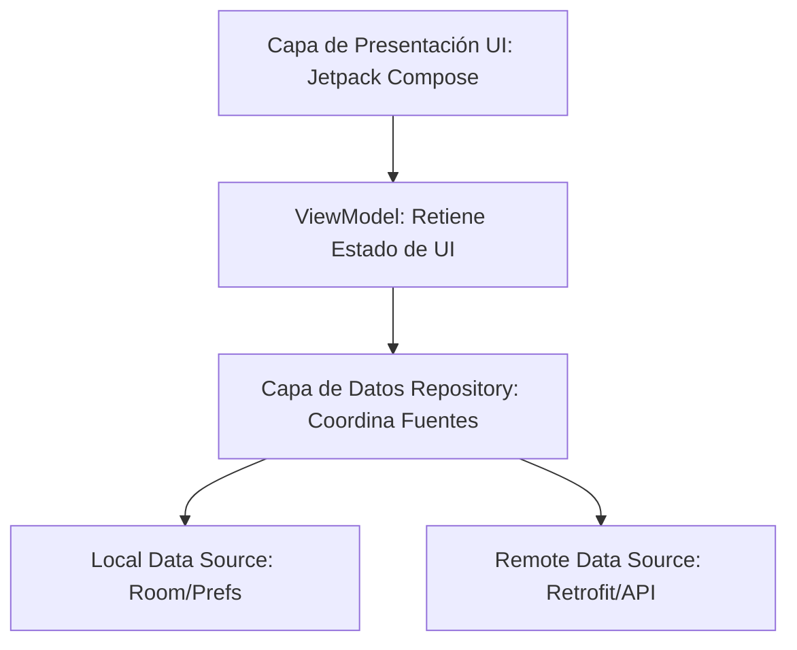

# Android Clean Architecture & MVVM Standards

Aplica estas directrices de arquitectura para mantener una base de código desacoplada, testeable, mantenible y altamente escalable en cualquier aplicación Android.



---

## 1. Capa de Presentación (View & ViewModel)

* **Compose UI:** Las vistas son funciones composables sin estado directo de negocio. Solo reaccionan a los estados emitidos por el `ViewModel`.
* **ViewModel:**
  * Debe heredar de `androidx.lifecycle.ViewModel`.
  * Expone el estado a través de un `StateFlow` inmutable para evitar modificaciones fuera del ViewModel.
  * Encapsula las Coroutines usando `viewModelScope`:
    ```kotlin
    @HiltViewModel
    class MyViewModel @Inject constructor(
        private val repository: DataRepository
    ) : ViewModel() {
        
        private val _uiState = MutableStateFlow<UiState>(UiState.Loading)
        val uiState: StateFlow<UiState> = _uiState.asStateFlow()

        fun loadData() {
            viewModelScope.launch {
                repository.getData().collect { data ->
                    _uiState.value = UiState.Success(data)
                }
            }
        }
    }
    ```

---

## 2. Capa de Datos (Repository)

* **Patrón de Repositorio:** El repositorio actúa como el único punto de acceso a los datos de la app. Coordina si la información se recupera de un origen local (caché local/base de datos Room) o de un origen remoto (API HTTP/Retrofit).
* **Flow de Kotlin:** Utiliza `Flow` para transmitir flujos de datos asíncronos y reactivos desde la base de datos o el cliente de red hacia el ViewModel.

---

## 3. Inyección de Dependencias (Hilt)

* **Hilt / Dagger:** Usa Hilt para inyectar dependencias y desacoplar componentes. Anota la clase Application con `@HiltAndroidApp` y los ViewModels con `@HiltViewModel`.
* **Modules:** Organiza la provisión de instancias de base de datos (`@Provides @Singleton`) y clientes HTTP/Retrofit en módulos de Hilt (`@Module @InstallIn(SingletonComponent::class)`).
