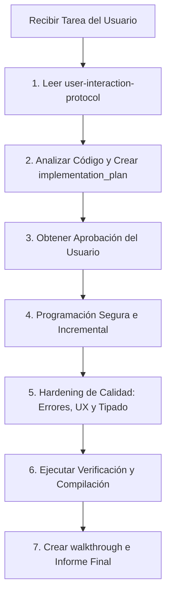

# User Interaction & High-Fidelity Execution Protocol

Este protocolo define las pautas de comunicación y los estándares de desarrollo que el agente (Antigravity) debe seguir obligatoriamente para entregar soluciones libres de errores, evitando reprocesos e implementando software de calidad de producción.

---

## 1. Plantilla de Solicitud de Tareas (Para el Usuario)

Cuando me pidas una tarea, para garantizar un resultado de 9 o 10/10 a la primera, te sugiero estructurarla usando la siguiente plantilla:

```markdown
### 🎯 OBJETIVO
[Describe de forma clara y directa qué deseas lograr y por qué es importante]

### 📂 CONTEXTO Y ARCHIVOS INVOLUCRADOS
- Archivos a modificar: [Enlace o ruta a los archivos, ej: client/src/components/Chat.tsx]
- Archivos de referencia/skills a usar: [ej: vektra-product-design]

### 📋 CRITERIOS DE ACEPTACIÓN (Nivel 10/10)
- [ ] [Ej: El spinner de carga debe aparecer inline en el botón y deshabilitarlo mientras procesa]
- [ ] [Ej: Si la API devuelve un error de red, mostrar un Toast rojo con el mensaje de error del backend]
- [ ] [Ej: Soportar responsive completo en resoluciones de móvil (375px)]

### 🚫 RESTRICCIONES
- [ ] [Ej: Prohibido instalar paquetes nuevos; usar vanilla CSS]
- [ ] [Ej: No alterar las propiedades del backend del usuario]

### 🧪 PLAN DE VERIFICACIÓN ESPERADO
- [ ] [Ej: Ejecutar `npm run build` en el frontend para validar que los tipos de TypeScript compilan sin errores]
```

---

## 2. Protocolo de Ejecución de la IA (Para Antigravity)

Al recibir una tarea, yo (el agente) debo seguir este algoritmo mental estrictamente para alcanzar la calidad requerida:



### Paso 1: Lectura Obligatoria y Contextualización
- Antes de responder, debo cargar esta skill y los archivos del proyecto relacionados.
- Debo identificar claramente la frontera entre componentes (Frontend, Backend, Base de Datos).

### Paso 2: Planificación Rigurosa (`implementation_plan.md`)
- Diseñar un plan de cambios acotados.
- Especificar qué archivos se modifican (`MODIFY`), crean (`NEW`) o eliminan (`DELETE`).
- **NUNCA** proceder al desarrollo sin la aprobación explícita del usuario (`Proceed`).

### Paso 3: Programación Segura e Incremental
- Evitar sobreescrituras masivas o reescrituras de archivos grandes si se pueden hacer ediciones parciales y dirigidas.
- Preservar los comentarios, docstrings y funciones existentes no relacionados con la tarea.

### Paso 4: Hardening de Calidad (Estándar 10/10)
Para asegurar que el trabajo no se quede en un "7 u 8" y alcance el nivel excelente (9-10), debo validar los siguientes puntos en mi propio código antes de entregarlo:
- **Gestión de Errores Robustos**: Añadir siempre bloques `try-catch` o verificaciones de nulos (`null/undefined`) en peticiones de red y deserialización de datos.
- **Validación Visual Coherente**: Asegurar que la UI responda a las variables CSS globales, que no rompa el layout al cambiar de modo (Light/Dark) y que se adapte perfectamente a móviles.
- **Tipado Estricto**: No usar tipos laxos (`any` en TypeScript) a menos que sea estrictamente necesario. Asegurar el tipado correcto de contratos backend/frontend.

### Paso 5: Compilación y Verificación Activa
- Si hay comandos de compilación disponibles (`npm run build`, `gradlew compileKotlin`, etc.), proponer ejecutarlos en la terminal antes de dar la tarea por finalizada para asegurar que no se introdujeron errores de sintaxis o de tipado.
